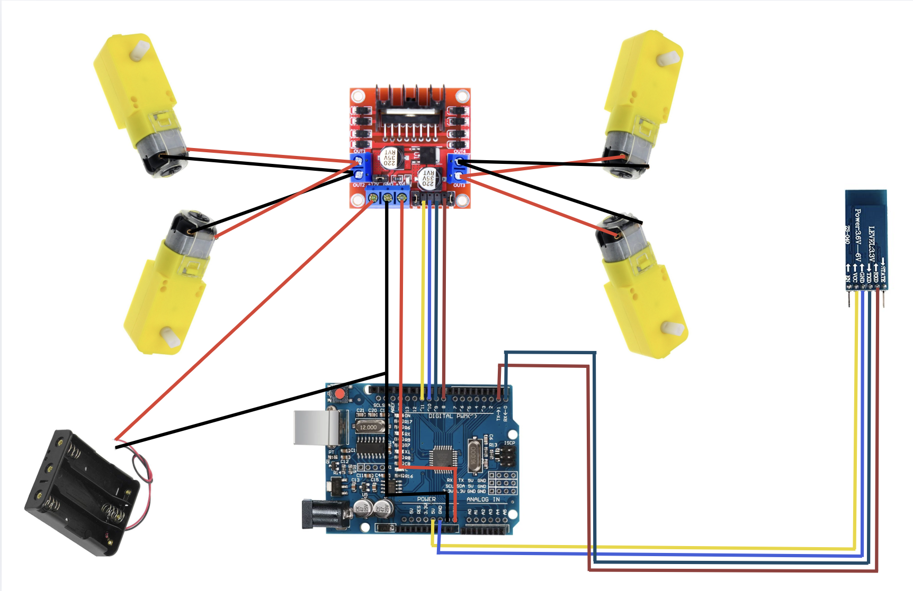
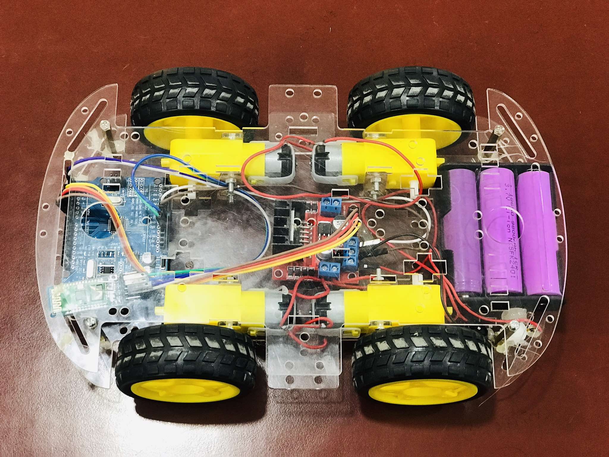

# Bluetooth-RC-car
In this project, I tried to make a Bluetooth controlled RC car. I used the following components in this project:
1. Arduino Uno
2. L298n Motor Driver
3. HC-05 Bluetooth Transreciever Module
4. BO Motors
5. Li-ion Battery

## Circuit Diagram:

## Final Result:

## How this works:
After doing all the connections, you need to upload the code to Arduino, but remember since we are not using "software serial" we need to disconnect the bluetooth module.

### why disconnect the bluetooth module?
The Arduino Uno communicates with your computer (for uploading code) using the same RX (pin 0) and TX (pin 1). The HC-05 also uses RX/TX for communication.
If both the HC-05 and USB connection are active at the same time, they conflict, preventing proper code upload. If you don't disconnect the bluetooth module,
the code upload may freeze or fail.

After uploading the code, you need to download an app to send the commands, I used [this](https://bluetooth-rc-car.en.softonic.com/android) app. Just download this app and 
connect your module to your phone via bluetooth and control your car!
